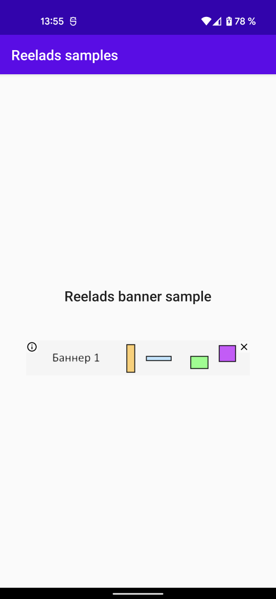
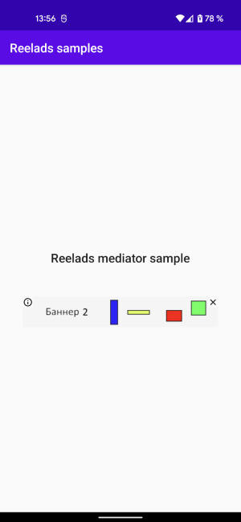

# Reelads-samples

Примеры интеграции библиотеки отображения баннеров в Android приложение

Перед сборкой проекта

1. Зарегистрируйтесь на [Reelads](https://reelads.net/sign-up)
2. Скачайте архив с библиотекой отображения баннеров [reelads-android-libs](https://reelads.net/quick-start/download-libs)
3. Распакуйте архив в директорию`libs`

Скриншоты экранов

| BannerSampleActivity | MediatorSampleActivity |
| :---: | :---: |
|  |  |
